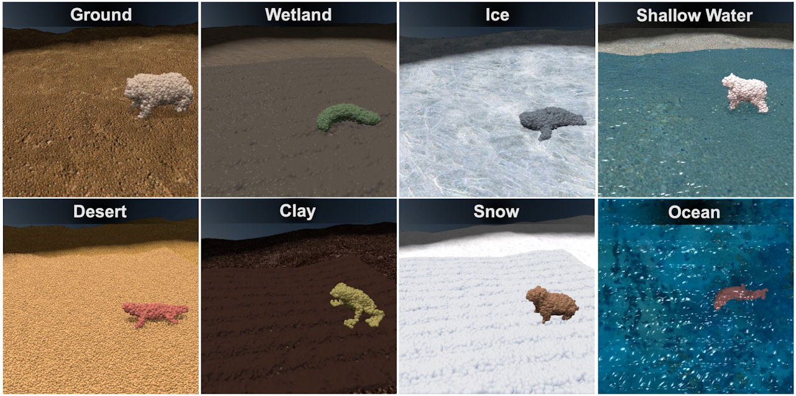

# SoftZoo: A Soft Robot Co-design Benchmark For Locomotion In Diverse Environments

### [[OpenReview]](https://openreview.net/forum?id=Xyme9p1rpZw)[[Demo]](https://sites.google.com/view/softzoo-iclr-2023) ###

SoftZoo is a soft robot co-design platform for locomotion in diverse environments that,
* supports an extensive, naturally-inspired material set, including the ability to simulate environments such as flat ground, desert, wetland, clay, ice, snow, shallow water, and ocean.
* provides a variety of tasks relevant for soft robotics, including fast locomotion, agile turning, and path following, as well as differentiable design representations for morphology and control.

With this platform, we study a wide variety of prevalent representations and co-design algorithms.



## Dependencies
### (Recommended) Create conda environment
```
$ conda create -n softzoo python==3.8
$ conda activate softzoo
```
### Install required packages.
(other versions may also work but we tested with the listed versions).
```
$ pip install taichi==1.4.1
$ conda install pytorch torchvision pytorch-cuda=11.7 -c pytorch -c nvidia
$ pip install -r requirements.txt
```
### Other packages.
(only required in some of the experiments/tools; also while we only tested with the following versions, other versions may still work).
* [mesh_to_sdf-0.0.14](https://github.com/marian42/mesh_to_sdf)
* [pynput-1.7.6](https://pypi.org/project/pynput/)
* [seaborn-0.12.1](https://pypi.org/project/seaborn/)
* [stable-baselines3-1.4.0](https://stable-baselines3.readthedocs.io/en/master/)
* [huggingface-sb3-2.2.4](https://pypi.org/project/huggingface-sb3/)
* [optuna-3.0.0](https://pypi.org/project/optuna/)
* [texturize-0.12](https://github.com/texturedesign/texturize)
* [pytorch3d-0.7.2](https://pypi.org/search/?q=pytorch3d)
* [roma-1.3.1](https://pypi.org/project/roma/)
* [neat-python-0.92](https://neat-python.readthedocs.io/en/latest/installation.html)
* [opencv-python-4.7.0.72](https://pypi.org/project/opencv-python/)
### Install SoftZoo.
```
$ git clone git@github.com:zswang666/softzoo.git
$ cd softzoo/
$ pip install -e .
```

## Download Assets
Download the assets from [drive](https://drive.google.com/drive/folders/1AYeZsr2ZMb1DkeOndQM0nBlNfx7dorUL?usp=sharing) and put them in [./softzoo/assets](./softzoo/assets). They should follow the folder structure,
```
├── assets
│   ├── meshes
│       ├── pcd
│       ├── ...
│   ├── textures
│   ├── ...
```
Some animal meshes are from [https://www.davidoreilly.com/library](https://www.davidoreilly.com/library).

## Running Experiments
### Control optimization with differentiable physics.
Use differentiable physics to optimize the control of an animal-like robot with human-annotated muscle placement and direction. You can try out different animals in different environments. You can also run with customized robot design (in pcd format) via this script.
```
$ bash scripts/diffsim_with_annotated_pcd.sh 
```
### Control optimization with reinforcement learning
Use reinforcement to optimize the control of an animal-like robot with human-annotated muscle placement and direction. We adapt implementation from `stable-baselines3` and use PPO for the experiments in the paper.

Additionally required packages: `seaborn`, `stable-baselines3`, `optuna`, `huggingface_sb3`.
```
$ bash scripts/rl_with_annotated_pcd.sh 
```

### Co-design / design optimization with differentiable physics.
Perform co-design or design optimization with various design space representation using differentiable physics.

Download pre-trained controller for swimmer from [drive](https://drive.google.com/drive/folders/1EuAZW0TaxIk3KnsFQrcSvbzvvTTQPaQr?usp=share_link) and put it in `./local/` or any other place if changing the bash script accordingly.

Additionally required packages: `pytorch3d`, `roma`.
```
$ bash scripts/design_opt_implicit_func.sh
$ bash scripts/design_opt_diff_cppn.sh
$ bash scripts/design_opt_sdf_basis.sh
$ bash scripts/design_opt_wass_barycenter.sh
```

### Co-design with evolutionary algorithm.
Other than gradient-based method via differentiable physics (first-order) or reinforcement learning (zeroth-order), we can also perform co-design optimization with evolutionary algorithm. We implemented a well-known algorithm [CPPN-NEAT](https://neat-python.readthedocs.io/en/latest/index.html), adapted from its [pytorch version](https://github.com/uber-research/PyTorch-NEAT).

Additionally required packages: `neat-python`.

```
$ bash scripts/cppn_neat.sh
```
We can also visualize robot design from genome.
```
$ python -m algorithms.cppn_neat.tools.visualize_gnome --genome-path <path-to-genome.pkl> --use-optim-obj
```

### Demo example of extension to manipulation.
Demonstrate a simple example that uses differentiable physics to optimize a hand-like soft robot to throw a snowball.
```
$ bash scripts/demo_manipulation.sh
```

### Human control.
We provide a simple interactive script that allows human control of the soft robot. This script is particularly useful to check if a robot design is even controllable. By default, we use keys `['q', 'w', 'e', 'r', 't', 'y', 'u', 'i', 'o', 'p', 'z', 'c', 'b']` for positive force and keys `['a', 's', 'd', 'f', 'g', 'h', 'j', 'k', 'l', 'Return', 'x', 'v', 'n']` for negative force. Check more details in [algorithms/human/run.py](algorithms/human/run.py). Note that this script requires on-screen rendering.
```
$ python -m algorithms.human.run --env-config-file human.yaml --designer-type annotated_pcd --annotated-pcd-path ./softzoo/assets/meshes/pcd/Caterpillar.pcd
```

## Tools
### Manual annotation of muscle placement.
We provide a simple script to convert a 3D mesh into points (which can be consumed by SoftZoo, or more precisely MPM) along with functions to manually annotate muscle group and automatically generate muscle direction. Note that this script requires on-screen rendering.
```
$ python -m softzoo.tools.annotate_mesh --mesh-path ./softzoo/assets/meshes/stl/Hippo.stl --out-path ./softzoo/assets/meshes/pcd/Hippo.pcd --n-clusters 5
```

### Generate terrain texture.
We construct terrain based on a procedurally generated height map and synthesized texture attached to the surface mesh. We use the texture synthesis tool, [texturize](https://github.com/texturedesign/texturize).

Additionally required packages: `texturize`.
```
$ python -m softzoo.tools.generate_texture --input-path ./softzoo/assets/textures/ground.png --output-path ./local/test_texturize.png
```

## Render with GL
Other than the built-in renderer in Taichi's GGUI, we also use a rendering tool adapted from [FluidLab](https://github.com/zhouxian/FluidLab) for better visual effect. This renderer is based on GL and [NVIDIA FleX](https://developer.nvidia.com/flex#:~:text=FleX%20is%20a%20particle%20based,%2C%20fluids%2C%20clothing%2C%20etc.), and it requires compilation.

First we need to download [docker](https://docs.docker.com/engine/install/ubuntu/) and [nvidia-docker](https://docs.nvidia.com/datacenter/cloud-native/container-toolkit/install-guide.html#setting-up-docker). Please follow the instructions from both links. Also, remember to install nvidia-docker and [pybind11](https://anaconda.org/conda-forge/pybind11),

```
$ sudo apt-get install -y nvidia-docker2
$ conda install -c conda-forge pybind11
```

Then we can start the compilation.

```
$ cd softzoo/engine/renderer/gl_renderer_src/
$ bash build_docker.sh
$ bash run_docker.sh
# inside the docker container
$ . /home/<username>/anaconda3/bin/activate softzoo # remember to replace the username
$ . prepare.sh
$ . compile.sh
```
You should see `[100%] Built target flex_renderer` at the end of the compilation and `flex_renderer.cpython-38-x86_64-linux-gnu.so` in the folder `gl_renderer_src/`.

Additionally required packages: `opencv-python`.

```
$ bash scripts/render.sh
```
